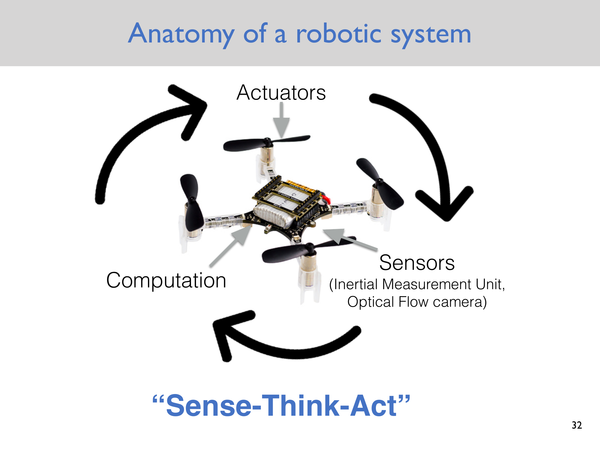
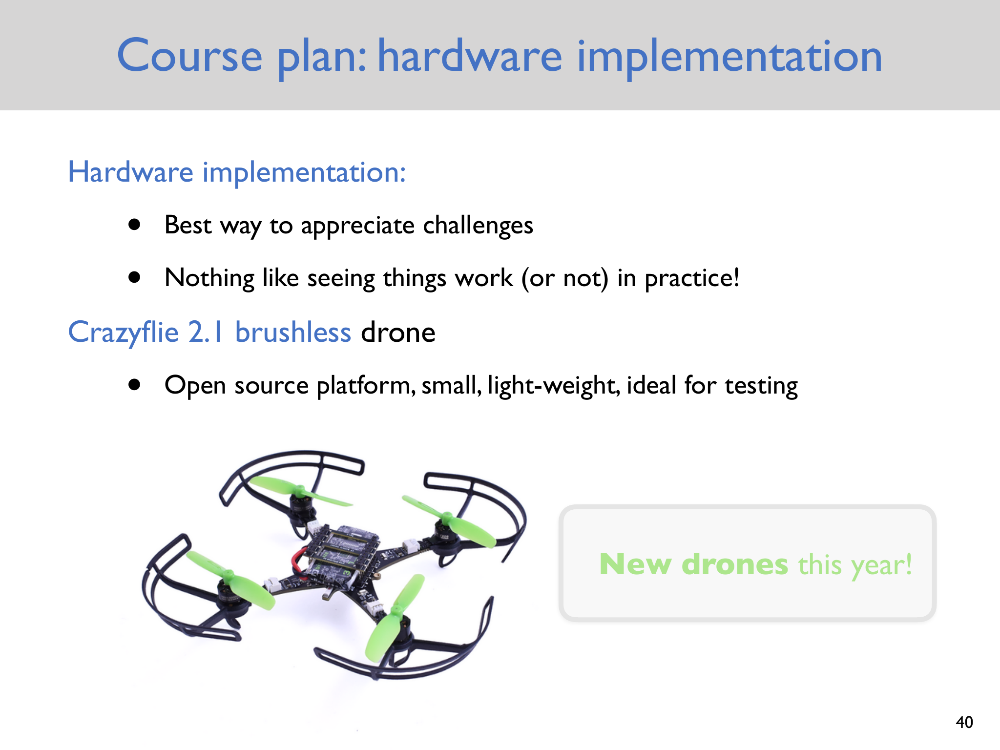
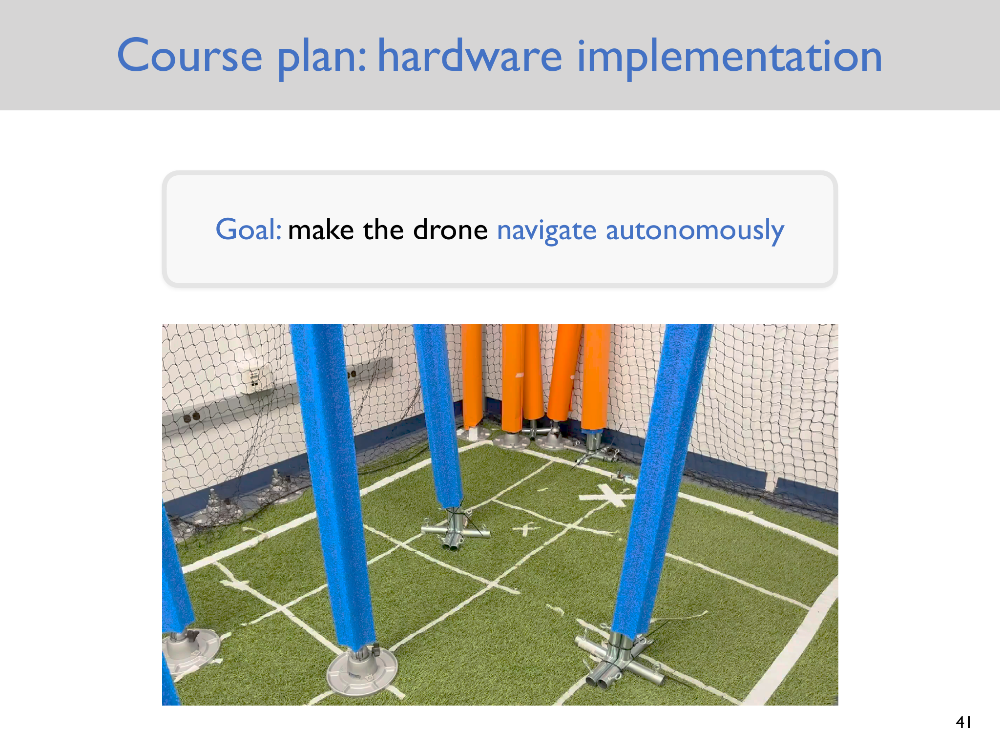

# Lecture 1 — Introduction to Robotics

> - **Topic:** What robots are, how modern robotic systems are organized, and why robotics is difficult
> - **Instructor:** Anirudha Majumdar
> - **Course:** Princeton ROB 345/549, Fall 2026
> - **Official course page:** <https://irom-lab.princeton.edu/intro-to-robotics/>
> - **Lecture video:** <https://www.youtube.com/watch?v=cMhFAq53v1c>
> - **Lecture slides:** <https://www.dropbox.com/scl/fi/oltefsy9ihq4efgxvtyn9/Lecture1.pdf?dl=0&rlkey=4kc7a1r2pja5z932phyakcq73>
> - **Accessed:** 2026-09-13

## Lecture at a glance

The opening lecture positions robotics as the engineering of embodied agents: machines that sense the physical world, compute decisions, and act on that world. It emphasizes that no single definition cleanly separates robots from ordinary machines, computers, vehicles, or teleoperated devices. The more useful question is therefore how a robotic system is organized and what technical problems must be solved.

The course organizes those problems into three connected areas: planning and control; localization and mapping; and robot learning. The theme joining them is uncertainty. Robots rarely know their exact state or environment, their physical models are imperfect, and learned behavior depends on incomplete data and ambiguous human intent. The course pairs theory with implementation on a Crazyflie quadrotor so that these modeling gaps become concrete.

## Learning objectives

After reviewing this lecture, you should be able to:

- explain why defining “robot” is useful but inherently ambiguous;
- describe a robot using the sense-think-act loop;
- identify the roles of sensors, computation, and actuators;
- distinguish the course's three major technical areas;
- name important sources of uncertainty in each area; and
- explain why hardware experiments reveal problems that idealized models hide.

## 1. Motivation: modern robots and the lab-to-world gap

The lecture begins with a snapshot of contemporary robotics and the goal of building generalist robots that are helpful, safe, and trustworthy. Modern demonstrations can make robots look broadly capable, but a controlled laboratory result is not the same as dependable operation in an open world. Moving from the lab to real use exposes variation in lighting, surfaces, object geometry, people, hardware, and task interpretation.

The course goal is to understand the technical foundations beneath modern systems rather than treating impressive demonstrations as black boxes. Robotics naturally connects several disciplines:

- **machine learning** for behavior learned from data;
- **control** for turning desired motion into stable physical behavior;
- **optimization** for choosing motions, controls, or model parameters;
- **vision and sensing** for extracting state and environmental information; and
- **planning** for selecting actions that accomplish a goal.

The lecture also makes broader impacts part of the subject: privacy, ethics, safety, and alignment with human values are properties of deployed robotic systems, not afterthoughts detached from the technical design.

## 2. A short history and the problem of definition

The historical sketch runs from imagined and mechanical automata to programmable industrial machinery:

- Talos in Greek mythology, around 1000 BCE;
- early automata, roughly 300 BCE–100 CE;
- machines associated with the Banu Musa brothers and al-Jazari;
- designs by Leonardo da Vinci;
- philosophical and mechanical developments through Descartes and the automata of the 1700s;
- Babbage's programmable-computation ideas in the 1800s;
- Karel Čapek's 1920 play *R.U.R.*, from which the word “robot” entered common use; and
- Unimate, associated with George Devol and Joseph Engelberger, in the industrial-robot era.

The word's history connects “robot” with work or labor, but that origin does not provide a technically sharp definition.

### Working definition

The lecture offers a compact working definition:

> A robot is an embodied agent that can be programmed to perform physical tasks.

Each part matters:

- **Embodied** means the agent has a physical presence and interacts with a physical environment.
- **Agent** suggests a system that receives information, makes or executes decisions, and affects its surroundings.
- **Programmable** separates adaptable machines from mechanisms with only a fixed physical response.
- **Physical tasks** distinguish robotics from purely informational computation.

Other reasonable definitions emphasize automatic execution of complex actions, reprogrammable manipulation, or autonomy through sensing, computation, and action. None draws an uncontested boundary. For example, a teleoperated surgical system is embodied and performs physical work, but the degree of autonomy differs from that of a self-directed mobile robot. Likewise, a modern vehicle may contain extensive sensing and control while still being described primarily as a car.

**Key lesson:** “robot” is a family-resemblance concept. The sensing, decision, and actuation structure is often more informative than arguing over the label.

## 3. Anatomy of a robotic system

The lecture uses the **sense-think-act** abstraction:

```text
physical world → sensors → computation → actuators → physical world
                      ↑___________________________|
```

### Sense

Sensors produce measurements related to the robot and its surroundings. The Crazyflie examples include:

- an **inertial measurement unit (IMU)**, which typically measures angular velocity and linear acceleration; and
- an **optical-flow camera**, which estimates apparent image motion and helps infer motion relative to a surface.

Measurements are not the state itself. They are indirect, noisy, delayed, and sometimes ambiguous. Converting them into an estimate of position, velocity, attitude, or map structure is an inference problem.

### Think

Onboard or external computation converts measurements and goals into decisions. “Think” covers several time scales:

- estimating the current state;
- deciding where to go;
- generating a collision-free path;
- computing commands that track the path; and
- adapting behavior from data or feedback.

The word does not imply human-like cognition. A feedback controller performing a small matrix calculation is part of the same computational layer as a learned vision policy.

### Act

Actuators turn commands into physical forces or motion. For a quadrotor, motors change propeller thrust. The resulting motion changes future sensor measurements, closing the loop.

**Derived observation:** The diagram is a feedback loop, not a one-way pipeline. Every action changes the physical state that the next sensing-and-computation cycle must interpret.

### Slide illustration: sense-think-act anatomy



*Source: official Lecture 1 slides, PDF page 31 (slide number 32), [Lecture1.pdf](https://www.dropbox.com/scl/fi/oltefsy9ihq4efgxvtyn9/Lecture1.pdf?dl=0&rlkey=4kc7a1r2pja5z932phyakcq73).*

## 4. The three technical pillars

### Planning and control

This area asks what the robot should do and how it should physically do it. The planned topics are:

- geometric motion planning;
- robot dynamics;
- feedback control; and
- planning with dynamics constraints.

Geometric planning may first ask only whether a collision-free path exists. Dynamics and control then ask whether the robot can follow a desired motion given inertia, forces, actuator limits, disturbances, and stability requirements.

### State estimation, localization, and mapping

This area asks what the robot and environment are like, given incomplete observations. The planned tools include:

- Bayes filtering;
- Kalman filtering;
- particle filtering; and
- simultaneous localization and mapping (SLAM).

Localization estimates the robot's state relative to a map. Mapping estimates the environment. SLAM couples the two: the robot tries to build a map while also determining its own pose within it.

### Robot learning

This area asks how robots can acquire models or behaviors from data and experience. The course plans to cover:

- imitation learning;
- generative architectures;
- reinforcement learning; and
- world models.

The final project connects learning to the course's motivating goal: training a vision-based navigation policy by imitation.

## 5. Why robotics is hard: uncertainty everywhere

The lecture categorizes uncertainty by technical area.

| Area | Representative uncertainty |
|---|---|
| Planning and control | robot dynamics, world dynamics, and the robot's initial state |
| Localization and mapping | robot state, world geometry, and environmental semantics |
| Robot learning | data quality, human intent, and rewards or feedback from the world |

These uncertainties interact. A planner may produce a safe route under an exact map, but localization error can place the real robot closer to an obstacle than expected. A controller may be stable under a nominal mass and thrust model, but battery voltage or payload changes can alter the dynamics. A learned policy may imitate demonstrations well while failing on scenes absent from its training data.

This leads to a central systems principle:

> A robotics component cannot be evaluated only under the assumptions made by the component immediately before it.

Planning, estimation, control, learning, and hardware must tolerate one another's errors.

## 6. Hardware implementation: the Crazyflie platform

The course uses the Crazyflie 2.1 brushless drone, an open-source, small, lightweight platform. The public course page lists a Flow deck v2 and Crazyflie PA radio for the motion-planning and feedback-control assignments. The small platform makes rapid testing practical, while the netted laboratory spaces reduce the consequences of failure.

The implementation goal is autonomous navigation. Hardware work is pedagogically important because it makes abstract assumptions visible:

- sensors drift and return noisy measurements;
- radio and computation introduce timing constraints;
- actuators saturate and vary across units;
- aerodynamic effects and collisions are real; and
- integration errors can dominate a theoretically correct component.

Teams are used for hardware portions, reflecting the fact that successful robotics work spans mechanics, electronics, software, perception, and control.

### Slide illustrations: hardware implementation



*Source: official Lecture 1 slides, PDF page 39 (slide number 40), [Lecture1.pdf](https://www.dropbox.com/scl/fi/oltefsy9ihq4efgxvtyn9/Lecture1.pdf?dl=0&rlkey=4kc7a1r2pja5z932phyakcq73).*



*Source: official Lecture 1 slides, PDF page 40 (slide number 41), [Lecture1.pdf](https://www.dropbox.com/scl/fi/oltefsy9ihq4efgxvtyn9/Lecture1.pdf?dl=0&rlkey=4kc7a1r2pja5z932phyakcq73).*

## 7. Course structure and expectations

The lecture lists prerequisites in multivariable calculus, linear algebra, basic probability, basic differential equations, and programming; Python is the course language. The grading structure presented in the slides is:

- problem sets: 40%, combining theory, code, and hardware;
- in-person midterm: 30%; and
- final project: 30%.

The graduate track, ROB 549, includes additional assignment problems.

### Generative-AI policy presented in Lecture 1

The lecture frames a tension between becoming proficient with AI tools and retaining the discipline required to learn fundamentals. Its slides permit four categories of use: analyzing past assignments, explaining technical concepts, asking about Python syntax, and use on hardware-based assignments and the final project. Other uses are described as disallowed.

**Important limitation:** This note records the policy shown in the public Fall 2026 Lecture 1 slides. Enrolled students should follow the current syllabus and Canvas instructions if they differ.

## Important definitions

| Term | Meaning in this lecture |
|---|---|
| Robot | An embodied, programmable agent that performs physical tasks; a useful working definition rather than a perfect boundary |
| Sensor | A device that returns measurements related to the robot or environment |
| State | Variables needed to describe the robot for the task, such as position, velocity, and attitude |
| Actuator | Hardware that converts commands into physical effort or motion |
| Feedback loop | A cycle in which actions affect the world, new measurements are taken, and commands are updated |
| Localization | Estimating the robot's state or pose relative to a reference or map |
| Mapping | Estimating a representation of the environment |
| SLAM | Estimating a map and the robot's location in that map together |

## Assumptions, limitations, and common pitfalls

- **A demonstration is not a guarantee.** Performance in curated conditions says little by itself about robustness in a new environment.
- **Sensors do not directly reveal truth.** They provide measurements that require a model and estimation process.
- **Planning and control are not interchangeable.** A path describes desired geometry; a controller must create feasible, stable physical motion.
- **Autonomy is not binary.** Systems can divide sensing, decision-making, and execution between a human and a machine in many ways.
- **The sense-think-act diagram is simplified.** Real systems contain many nested feedback loops operating at different rates.
- **Ethics and safety are systems properties.** They cannot be assigned only to a final “policy” module after the technical system has been designed.

## Connections to upcoming lectures

Lecture 2 begins the planning-and-control pillar by making strong simplifying assumptions: the map and robot state are known, and any geometric path can be followed. Those assumptions isolate geometric motion planning. Later lectures relax them through dynamics, feedback control, state estimation, mapping, and learning.

## Review questions

1. Which edge cases make a strict definition of “robot” difficult?
2. In the sense-think-act loop, why is sensing an inference problem rather than a direct reading of state?
3. Give one source of uncertainty in planning/control, estimation/mapping, and learning.
4. Why can a collision-free geometric path still be impossible for a physical robot to execute?
5. How do localization error and control error interact with a planner's safety assumptions?
6. What does a hardware implementation teach that a simulation may conceal?
7. Why is autonomy better treated as a spectrum than a yes/no property?

## Compact takeaway

A modern robot is best understood as a closed-loop embodied system. It senses imperfectly, estimates and decides under uncertainty, and acts through imperfect physical hardware. The course builds the tools needed to make that loop work: planning and control decide and execute motion, estimation and mapping infer the state of the robot and world, and learning uses data to acquire behaviors and models.
