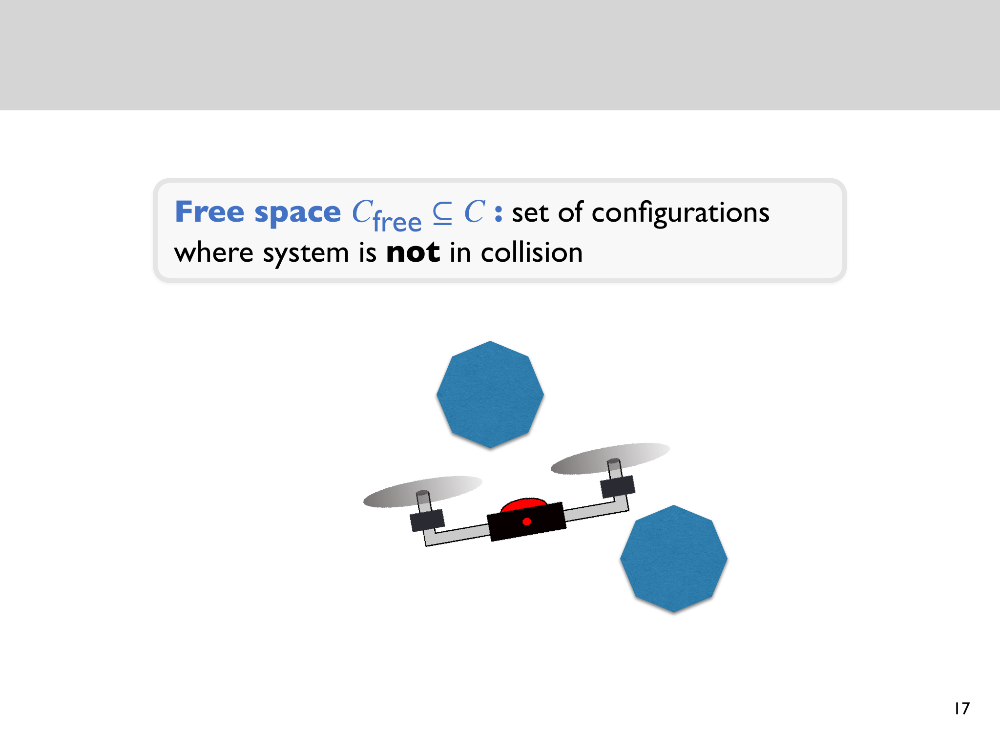
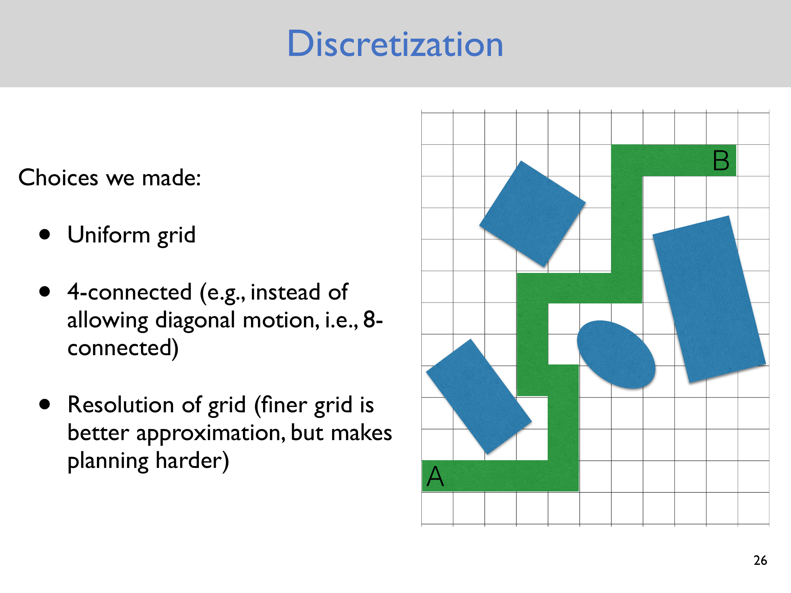
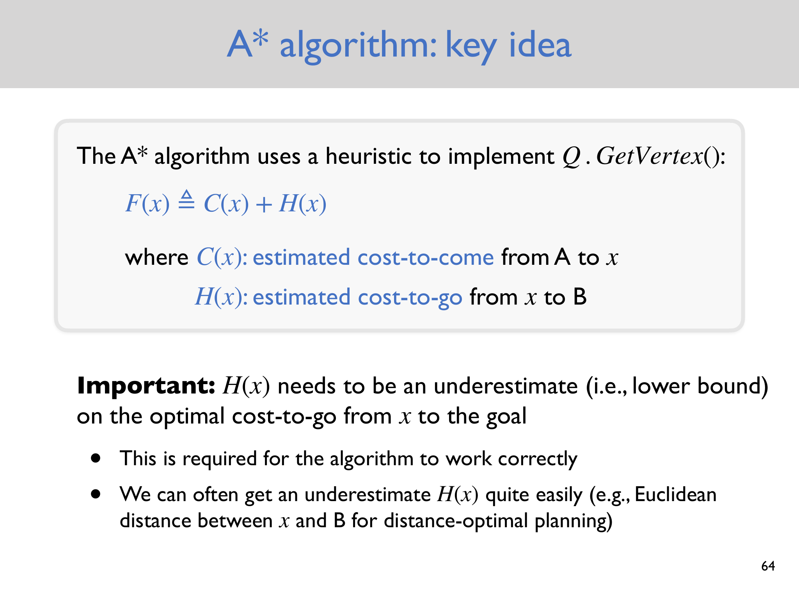
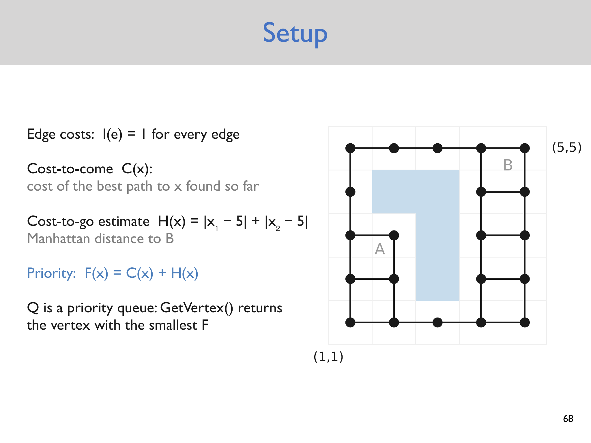

# Lecture 2 — Discrete Motion Planning

> - **Topic:** Converting geometric motion planning into graph search; BFS, DFS, Dijkstra, and A*
> - **Instructor:** Anirudha Majumdar
> - **Course:** Princeton ROB 345/549, Fall 2026
> - **Official course page:** <https://irom-lab.princeton.edu/intro-to-robotics/>
> - **Lecture video:** <https://www.youtube.com/watch?v=aVmqaI2WmBU>
> - **Lecture slides:** <https://www.dropbox.com/scl/fi/pnwucnirlwgviqwaj67hl/Lecture2.pdf?dl=0&rlkey=6s2et2apw9rtnvr8x2ke243sp>
> - **Accessed:** 2026-09-13

## Lecture at a glance

Motion planning asks for a collision-free route from a start configuration to a goal configuration. Lecture 2 first represents the robot in a **configuration space**, where every point denotes a complete configuration of the robot. Collision-free configurations form $\mathcal C_{\mathrm{free}}$; colliding configurations form $\mathcal C_{\mathrm{obs}}$.

The lecture then discretizes continuous free space into a graph. Grid cells become vertices, allowed one-step motions become edges, and obstacle cells and incident edges are removed. Once this conversion is made, planning becomes graph search. A common forward-search skeleton produces breadth-first search or depth-first search depending on how its frontier is ordered. Adding edge costs and a lower-bound estimate of remaining cost leads to A*, while setting the heuristic to zero gives Dijkstra's algorithm.

## Learning objectives

After reviewing this lecture, you should be able to:

- define degrees of freedom and configuration space;
- formulate geometric motion planning using $\mathcal C_{\mathrm{free}}$;
- turn a grid map into a graph and explain the modeling choices involved;
- trace forward search and reconstruct a path through parent pointers;
- explain how FIFO and LIFO frontiers produce BFS and DFS;
- formulate a path-cost objective;
- compute the A* priority $F=C+H$; and
- state the conditions needed for the main search guarantees.

## 1. Geometric motion planning

The motivating goal is autonomous vision-based navigation, but the lecture isolates one subproblem:

> Find a path from configuration $q_A$ to configuration $q_B$ without collision.

This is the classical **piano mover's problem**, a name associated with motion planning since early work in the 1980s. The problem studies whether a rigid object can move through an environment without intersecting obstacles. The slides note that the general problem is PSPACE-complete, which helps explain why practical planning relies on structured approximations and specialized algorithms.

### Simplifying assumptions

The lecture's geometric formulation assumes:

1. **Any geometric path is feasible to follow.** Dynamics, actuator limits, and tracking error are ignored.
2. **The robot state is perfectly known.** There is no localization uncertainty.
3. **A geometric map is given.** Mapping and perception are not part of this planning problem.

These assumptions are intentionally strong. They make it possible to study collision-free geometry before reintroducing dynamics, control, and estimation later in the course.

## 2. Degrees of freedom and configuration space

### Degrees of freedom

The number of **degrees of freedom (DoFs)** is the number of independent coordinates required to specify a system's configuration.

| System | DoFs | Example configuration space |
|---|---:|---|
| Point in $d$-dimensional Euclidean space | $d$ | $\mathbb R^d$ |
| $N$ independent points in $d$ dimensions | $Nd$ | $\mathbb R^{Nd}$ |
| Pendulum angle | 1 | $S^1$, the circle |
| Planar quadrotor | 3 | $\mathbb R^2 \times S^1$ |

A planar quadrotor configuration is

$$
q=(x,y,\theta),
$$

where $x$ and $y$ locate it in the plane and $\theta$ gives its orientation. The angle belongs to $S^1$, not an ordinary unbounded real line: angles separated by $2\pi$ represent the same orientation.

### Configuration space

The **configuration space** $\mathcal C$ is the set of all configurations the system may take. A point in physical workspace and a point in configuration space are not always the same thing. A single translating point robot has a simple correspondence, but a rigid body or articulated arm needs position and orientation or joint coordinates.

This abstraction converts collision checking for an extended robot into a classification of configurations:

$$
\mathcal C_{\mathrm{free}} \subseteq \mathcal C
$$

is the set of collision-free configurations, and

$$
\mathcal C_{\mathrm{obs}} = \mathcal C \setminus \mathcal C_{\mathrm{free}}
$$

is the obstacle region in configuration space.

The planning problem can now be written precisely: find a continuous path

$$
\tau:[0,1]\rightarrow \mathcal C_{\mathrm{free}}
$$

such that $\tau(0)=q_A$ and $\tau(1)=q_B$.

**Supplemental clarification:** Configuration-space obstacles depend on the robot's geometry, not only the world's obstacles. One common construction for a translating rigid robot “inflates” workspace obstacles by the reflected robot shape; the robot can then be treated as a point moving among the inflated obstacles.

### Slide illustration: free configuration space



*Source: official Lecture 2 slides, PDF page 17, [Lecture2.pdf](https://www.dropbox.com/scl/fi/pnwucnirlwgviqwaj67hl/Lecture2.pdf?dl=0&rlkey=6s2et2apw9rtnvr8x2ke243sp).*

## 3. Discretizing the planning problem

A continuous space contains infinitely many configurations, so the lecture approximates it with a finite grid. The example uses:

- a **uniform grid**;
- **4-connectivity**, allowing horizontal and vertical motion; and
- a chosen grid resolution.

The graph construction is:

1. Associate a vertex with each grid cell.
2. Connect two vertices when the robot may travel between their cells in one allowed step.
3. Delete occupied vertices and their incident edges.
4. Search the remaining graph from the start vertex to the goal vertex.

The lecture labels a vertex $(i,j)=(x,y)=(\text{column},\text{row})$. In its running example, the start is $A=(2,3)$ and the goal is $B=(5,5)$.

### Important design choices

**Connectivity.** A 4-connected grid permits only axis-aligned moves. An 8-connected grid also permits diagonals. Connectivity changes both which paths exist and how path cost should be defined. If all eight moves receive cost 1, diagonal travel is artificially cheap relative to Euclidean distance; diagonal edges often use cost $\sqrt 2$.

**Resolution.** A finer grid can approximate geometry more accurately and reveal narrow corridors, but it creates more vertices and edges. In two dimensions, halving cell width creates roughly four times as many cells over the same area; in $d$ dimensions, the growth is approximately $2^d$. This is one expression of the curse of dimensionality.

**Collision policy.** A cell should be marked free only under a clearly stated collision test. Testing the center alone can miss a collision involving the robot's body or an edge swept between neighboring cells.

**Derived observation:** The graph-search algorithm can be correct on the discrete graph while the resulting physical path is unsafe. Discretization and collision checking determine whether the graph is a faithful model of the continuous problem.

### Slide illustration: discretization choices



*Source: official Lecture 2 slides, PDF page 26, [Lecture2.pdf](https://www.dropbox.com/scl/fi/pnwucnirlwgviqwaj67hl/Lecture2.pdf?dl=0&rlkey=6s2et2apw9rtnvr8x2ke243sp).*

## 4. A common forward-search skeleton

The lecture presents a general forward search. Let $Q$ be the frontier: discovered vertices that still need to be explored.

```text
insert start A into Q
mark A visited

while Q is not empty:
    x = Q.get_vertex()
    if x is a goal:
        return SUCCESS

    for each neighbor x' of x:
        if x' is not visited:
            parent[x'] = x
            mark x' visited
            insert x' into Q

return FAILURE
```

Three details are essential:

- A vertex is marked visited when it is inserted, preventing duplicate frontier entries in the unweighted version.
- `parent[x'] = x` records how the search first reached $x'$.
- Once the goal is reached, repeatedly following parent pointers from the goal back to $A$ reconstructs the path in reverse.

The behavior of the algorithm depends on `Q.get_vertex()`.

## 5. Breadth-first search

**Breadth-first search (BFS)** implements the frontier as a first-in, first-out queue. It expands all vertices at graph distance $k$ before any vertex at distance $k+1$.

In the lecture example:

- initialize $Q=\{(2,3)\}$;
- expanding $(2,3)$ discovers $(1,3)$ and $(2,2)$;
- FIFO ordering expands $(1,3)$ next;
- its unvisited neighbors $(1,4)$ and $(1,2)$ are appended; and
- the search continues layer by layer until $(5,5)$ is reached.

BFS minimizes the number of edges in the returned path. If every edge has the same cost, this is also a minimum-cost path. If edge costs differ, a path with fewer edges may cost more, so ordinary BFS is no longer cost-optimal.

**Supplemental guarantee:** On a finite graph represented with adjacency lists, BFS runs in $O(|V|+|E|)$ time and uses $O(|V|)$ memory. It is complete for a reachable goal in a finite graph.

## 6. Depth-first search

**Depth-first search (DFS)** implements the frontier in last-in, first-out order, typically with a stack. The most recently discovered vertex is expanded next. The search therefore follows one branch deeply until it reaches a goal or dead end, then backtracks to another branch.

The lecture's ordering explores a route beginning

$$
(2,3)\rightarrow(1,3)\rightarrow(1,4)\rightarrow(1,5)
\rightarrow(2,5)\rightarrow(3,5)\rightarrow(4,5)\rightarrow(5,5).
$$

DFS can be effective when solutions are deep and few branches lead toward the goal. It does not, in general, find the shortest or lowest-cost path. Its result also depends strongly on the order in which neighbors are inserted.

**Supplemental guarantee:** With a visited set, DFS takes $O(|V|+|E|)$ time on a finite graph. Its active search stack can be smaller than BFS's frontier, although the visited and parent structures may still require $O(|V|)$ memory.

## 7. Adding path costs

Associate each edge $e$ with a traversal cost

$$
\ell(e).
$$

For a path $P$ consisting of edges $e_1,\ldots,e_k$, define

$$
J(P)=\sum_{i=1}^{k}\ell(e_i).
$$

The objective is no longer merely to reach the goal; it is to find

$$
P^*=\arg\min_P J(P).
$$

Costs can represent distance, time, energy, risk, or a weighted combination. A valid shortest-path formulation normally assumes nonnegative edge costs. The meaning and units of a combined cost should be explicit.

## 8. A* search

A* orders its frontier by an estimate of the total cost of a solution passing through vertex $x$:

$$
F(x)=C(x)+H(x),
$$

where:

- $C(x)$ is the cost of the best path from start $A$ to $x$ found so far, often written $g(x)$;
- $H(x)$ estimates the remaining cost from $x$ to goal $B$, often written $h(x)$; and
- $F(x)$ estimates the complete start-to-goal cost through $x$.

The frontier is a priority queue, and `get_vertex()` removes the vertex with smallest $F$.

### Slide illustrations: A* priority and setup



*Source: official Lecture 2 slides, PDF page 64, [Lecture2.pdf](https://www.dropbox.com/scl/fi/pnwucnirlwgviqwaj67hl/Lecture2.pdf?dl=0&rlkey=6s2et2apw9rtnvr8x2ke243sp).*



*Source: official Lecture 2 slides, PDF page 68, [Lecture2.pdf](https://www.dropbox.com/scl/fi/pnwucnirlwgviqwaj67hl/Lecture2.pdf?dl=0&rlkey=6s2et2apw9rtnvr8x2ke243sp).*

### Heuristic requirement

The lecture requires $H$ to underestimate, or lower-bound, the optimal remaining cost. Such a heuristic is **admissible**:

$$
0\le H(x)\le H^*(x),
$$

where $H^*(x)$ is the true optimal cost from $x$ to the goal.

An admissible heuristic does not rule out the optimal path by making it appear too expensive. A more informative lower bound usually reduces search, while a weak bound approaches uninformed search.

### Running example

Every edge in the lecture example has cost 1. For $x=(x_1,x_2)$ and goal $B=(5,5)$, the heuristic is Manhattan distance:

$$
H(x)=|x_1-5|+|x_2-5|.
$$

This is a lower bound on the number of unit-cost horizontal and vertical moves needed to reach the goal. At $A=(2,3)$:

$$
C(A)=0,\qquad H(A)=|2-5|+|3-5|=5,\qquad F(A)=5.
$$

Expanding $A$ reaches $(1,3)$ and $(2,2)$. Each has $C=1$, $H=6$, and $F=7$. The example breaks an $F$-tie by choosing smaller $H$. From $(1,3)$, it reaches $(1,4)$ with $C=2$, $H=5$, and $F=7$, while $(1,2)$ receives $C=2$, $H=7$, and $F=9$. The priority queue therefore continues exploring vertices that appear most promising under combined known and estimated cost.

### Alive, dead, and unvisited vertices

The slides use three states:

- **unvisited:** never encountered;
- **alive:** discovered and currently stored in the priority queue; and
- **dead:** removed from the queue and expanded.

For every neighbor $x'$ of expanded $x$, A* computes a tentative cost:

$$
C_{\text{tentative}}=C(x)+\ell(x,x').
$$

If this is lower than the recorded $C(x')$, the algorithm has found a better route and updates

$$
\operatorname{parent}(x')\leftarrow x,
$$

$$
C(x')\leftarrow C_{\text{tentative}},
$$

$$
F(x')\leftarrow C(x')+H(x').
$$

This operation is called **relaxation**. A* succeeds when the goal is selected for expansion; it fails if the frontier empties first.

### Dijkstra as a special case

Choosing

$$
H(x)=0\quad\text{for every }x
$$

makes $F(x)=C(x)$. A* then becomes Dijkstra's algorithm, which expands vertices according only to the cheapest known cost from the start.

## 9. Comparing the search strategies

| Algorithm | Frontier selection | Uses edge costs? | Uses goal heuristic? | Main guarantee under standard conditions |
|---|---|---:|---:|---|
| BFS | Oldest inserted vertex | Only implicitly equal costs | No | Minimum-edge path |
| DFS | Newest inserted vertex | No | No | Finds a reachable goal on a finite graph, but not necessarily a shortest path |
| Dijkstra | Smallest $C$ | Yes | No | Minimum-cost path for nonnegative costs |
| A* | Smallest $C+H$ | Yes | Yes | Minimum-cost path with the appropriate heuristic/closed-set conditions |

A* addresses two BFS limitations emphasized in the lecture:

1. BFS optimizes only path length when each edge counts equally.
2. BFS expands broadly without using information about the goal's direction or estimated remaining cost.

## 10. Subtleties and common pitfalls

### Admissibility versus consistency

The lecture states the essential idea that $H$ should be an underestimate. For graph-search A* with a permanent dead/closed set, a stronger property is useful:

$$
H(x)\le \ell(x,x')+H(x')
$$

for every edge $(x,x')$. This is **consistency**. With a consistent heuristic, once a vertex is removed at minimum $F$, its best cost is settled, so it need not be reopened. Manhattan distance on a 4-connected unit-cost grid is consistent.

**Supplemental clarification:** If a heuristic is admissible but inconsistent, a correct graph-search implementation may need to reopen a closed vertex when a cheaper path is discovered. The exact slide pseudocode skips dead vertices, so its clean optimality argument uses consistency or an equivalent condition.

### Heuristic and motion model must match

- Manhattan distance is appropriate for 4-connected unit-cost motion.
- Euclidean distance is a natural lower bound when travel cost is geometric distance.
- A heuristic that overestimates can make search faster but gives up the usual A* optimality guarantee.
- Changing diagonal costs, terrain costs, or motion constraints can invalidate a previously admissible heuristic.

### Search correctness is not model correctness

- A coarse grid can erase a valid narrow passage.
- A permissive collision test can admit unsafe edges.
- A route with sharp turns may be geometrically valid but dynamically infeasible.
- Perfect state and map assumptions do not hold on real hardware.
- High-dimensional grids grow exponentially and quickly become impractical.

### Parent and visited bookkeeping

- Parent pointers must be updated when a cheaper route is found in cost-based search.
- Marking vertices at the wrong time can create duplicate work or suppress a better route.
- Tie-breaking changes which equally optimal path is returned and may change search effort, but should not change optimal cost under valid A* conditions.

## 11. Connections to the rest of the course

This lecture solves a finite approximation of geometric planning. Lecture 3's randomized planners address continuous and high-dimensional spaces without exhaustively gridding them. Later dynamics and control lectures relax the assumption that every path can be followed. Estimation and mapping relax perfect state and map knowledge. Robot learning can supply policies, models, costs, or even learned search heuristics—the lecture closes by pointing to learned heuristics as a modern extension.

## Review questions

1. Why is $\mathbb R^2\times S^1$, rather than $\mathbb R^3$, the natural configuration space for a planar rigid body?
2. What information is lost when a continuous free space is replaced by a grid?
3. How do 4-connectivity, 8-connectivity, and grid resolution change the planning problem?
4. Why does FIFO ordering produce breadth-first behavior?
5. Under what condition does BFS return a minimum-cost path?
6. Why does DFS depend heavily on neighbor ordering?
7. What does a parent pointer represent, and how is the final path reconstructed?
8. In A*, what is the difference between $C(x)$, $H(x)$, and $F(x)$?
9. Why is Manhattan distance admissible on a 4-connected unit-cost grid?
10. How does setting $H=0$ change A*?
11. What additional issue arises when a heuristic is admissible but inconsistent?
12. Give an example of a path that is valid in the grid graph but unsafe or infeasible for the physical robot.

## Compact takeaway

Discrete motion planning is a modeling pipeline:

$$
\text{robot geometry}
\rightarrow \mathcal C_{\mathrm{free}}
\rightarrow \text{discrete graph}
\rightarrow \text{search}
\rightarrow \text{parent-pointer path}.
$$

BFS, DFS, Dijkstra, and A* differ mainly in how they order the frontier and what path information they use. Their guarantees apply to the graph that was built; safe and effective robot motion also depends on whether the configuration-space model, discretization, collision checks, costs, heuristic, and physical assumptions are appropriate.
