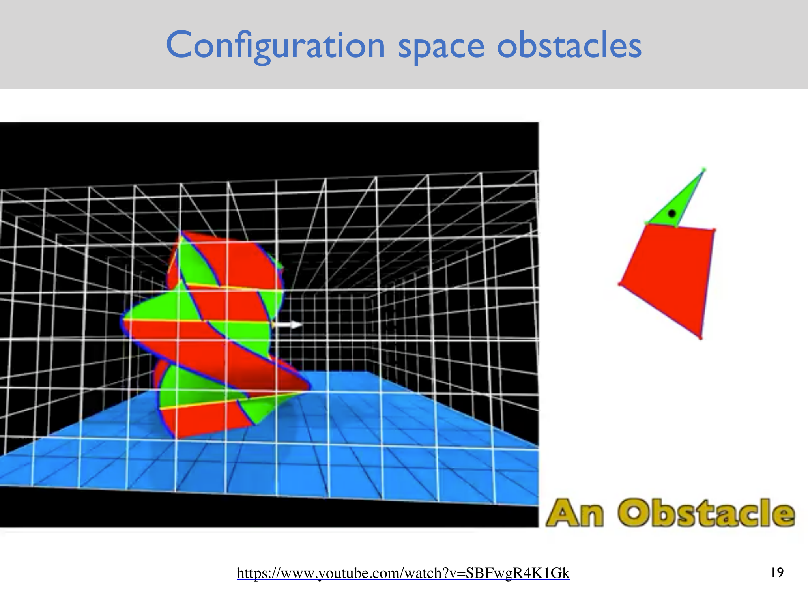
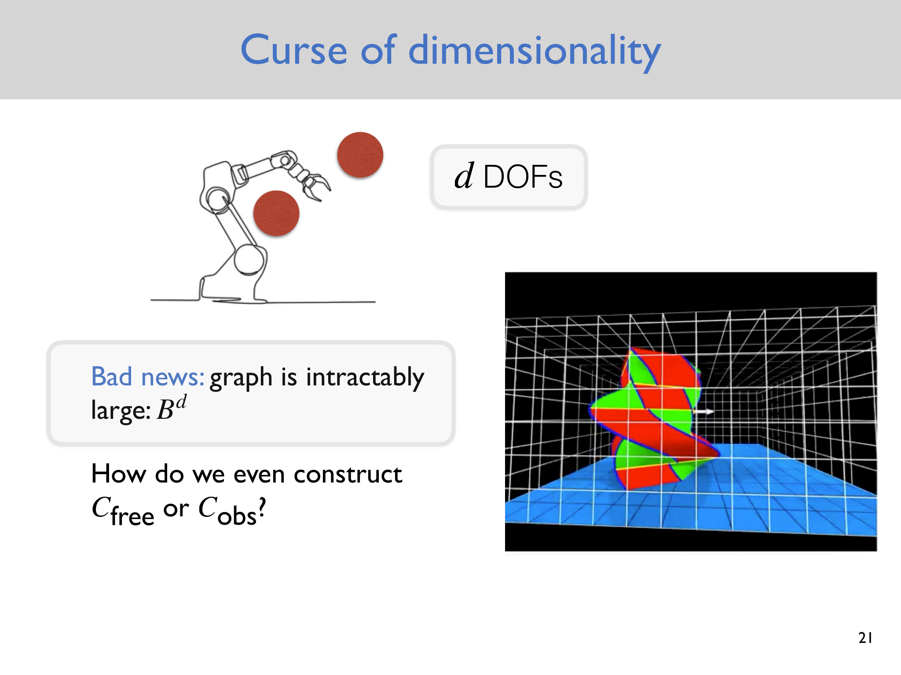
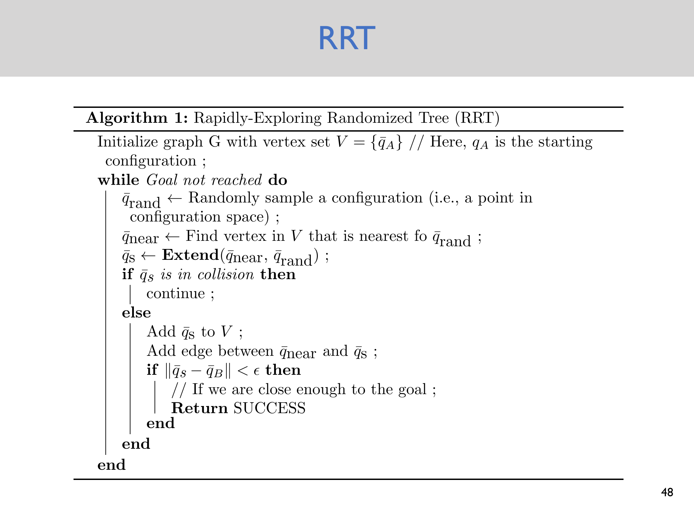
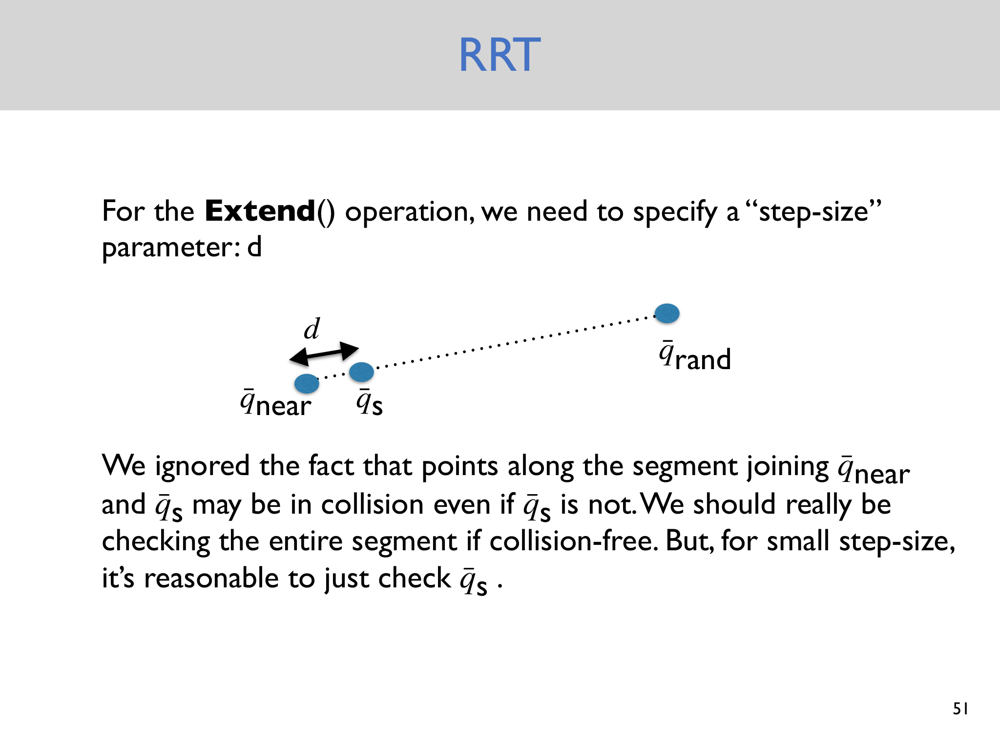
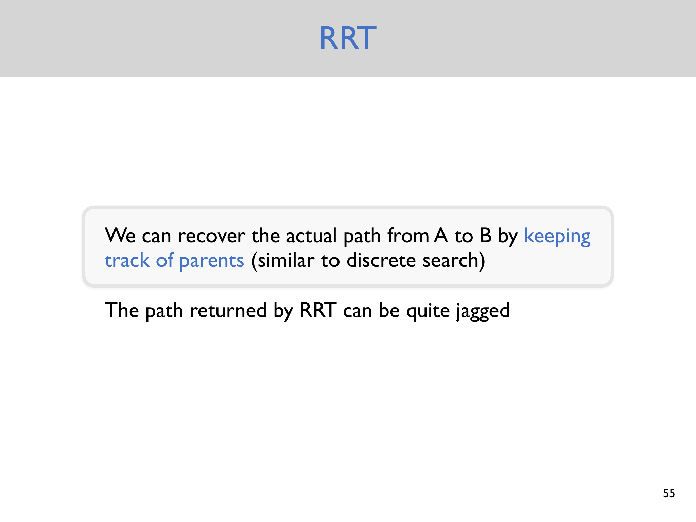
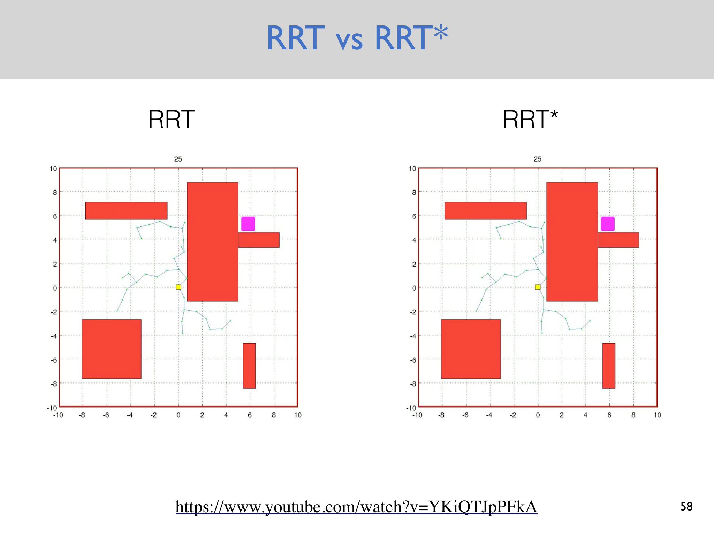

# Lecture 3 — Randomized Planning with RRTs

> - **Topic:** Randomized planning in continuous configuration spaces; rapidly-exploring randomized trees (RRTs)
> - **Instructor:** Anirudha Majumdar
> - **Course:** Princeton ROB 345/549, Fall 2026
> - **Official course page:** <https://irom-lab.princeton.edu/intro-to-robotics/>
> - **Lecture video:** <https://www.youtube.com/watch?v=KDIe1094FMo>
> - **Lecture slides:** <https://www.dropbox.com/scl/fi/5uv2vt76nqj4b32vr4i37/Lecture3.pdf?dl=0&rlkey=nx8jjqjlvmgcqqhb8r1p6okzp>
> - **Accessed:** 2026-09-26

## Lecture at a glance

Lecture 2 turned motion planning into graph search by discretizing a free configuration space. Lecture 3 asks what happens when that discretization becomes impractical. A robot with many degrees of freedom can require an enormous grid, and constructing the full configuration-space obstacle set can itself be difficult. RRTs address this by sampling configurations directly in continuous space, growing a tree from the start, and using collision checks only for the candidate extensions that are actually attempted.

The lecture's standard RRT is designed to find a feasible path, not necessarily a shortest or smooth one. Its practical strength is that it avoids explicitly enumerating all of configuration space while exploiting efficient geometric collision tests.

## Learning objectives

After reviewing this lecture, you should be able to:

- explain why robot geometry is handled in configuration space;
- describe why grid-based graph search suffers from a curse of dimensionality;
- state the three design ideas behind an RRT;
- trace one RRT iteration from a random sample to a new tree vertex;
- explain the role of the step size and collision checking; and
- reconstruct a path from the tree using parent pointers.

## 1. From geometric planning to configuration space

The starting problem is unchanged: find a collision-free motion from configuration $q_A$ to configuration $q_B$. A configuration includes every independent variable needed to place the robot. For a planar rigid body, for example, a configuration can be $(x,y,\theta)$ rather than only the position of a reference point.

The configuration space is the set of possible configurations, denoted $\mathcal C$. The free configuration space is

$$
\mathcal C_{\mathrm{free}} = \{q\in\mathcal C : \text{the robot placed at }q\text{ is not in collision}\},
$$

and the obstacle space is its complement,

$$
\mathcal C_{\mathrm{obs}} = \mathcal C\setminus\mathcal C_{\mathrm{free}}.
$$

Once the robot is represented as a point in configuration space, the geometric planning problem becomes finding a path in $\mathcal C_{\mathrm{free}}$. The difficulty is that the representation may have many dimensions and the obstacles in configuration space may be complicated.



*Source: official Lecture 3 slides, PDF page 19, [Lecture3.pdf](https://www.dropbox.com/scl/fi/5uv2vt76nqj4b32vr4i37/Lecture3.pdf?dl=0&rlkey=nx8jjqjlvmgcqqhb8r1p6okzp).*

### Inflating obstacles as a special case

For a circular approximation of a robot, collision checking can be viewed equivalently as inflating the physical obstacles by the robot radius and planning for a point. This intuition extends to configuration space, where the forbidden set accounts for the robot's full geometry and orientation. The lecture uses this equivalence to motivate configuration-space obstacles before moving to methods that avoid constructing them explicitly.

## 2. Why a grid becomes impractical

Suppose each of $d$ configuration coordinates is discretized into roughly $B$ bins. A full grid then contains on the order of

$$
B^d
$$

vertices. This exponential dependence on the number of degrees of freedom is the **curse of dimensionality**. A fine grid may be useful for a two-dimensional toy problem but becomes intractable for articulated robots, rigid bodies with orientation, or high-dimensional systems.

There is a second problem: even if the graph were not too large, explicitly constructing $\mathcal C_{\mathrm{free}}$ or $\mathcal C_{\mathrm{obs}}$ can be expensive. A planner may instead prefer to ask a narrower question—whether a particular candidate configuration or short motion is collision-free.



*Source: official Lecture 3 slides, PDF page 21, [Lecture3.pdf](https://www.dropbox.com/scl/fi/5uv2vt76nqj4b32vr4i37/Lecture3.pdf?dl=0&rlkey=nx8jjqjlvmgcqqhb8r1p6okzp).*

## 3. RRT design principles

The lecture introduces three principles:

1. **Work directly in continuous configuration space.** Sample points $q\in\mathcal C$ rather than committing to a global grid.
2. **Do not explicitly construct $\mathcal C_{\mathrm{obs}}$.** Keep a representation of the tree and query collision status only for proposed configurations or local edges.
3. **Use efficient collision checking.** Geometry algorithms such as GJK can make repeated collision queries practical for many shapes.

The result is a sparse, incrementally built tree that covers promising portions of the free space without paying the cost of enumerating every possible configuration.

## 4. One RRT iteration

Let $V$ be the current set of tree vertices, initialized with the start configuration $q_A$. A typical iteration is:

1. Sample a random configuration $q_{\mathrm{rand}}$ in the configuration space.
2. Find the existing vertex nearest to that sample, $q_{\mathrm{near}}$.
3. Extend from $q_{\mathrm{near}}$ toward $q_{\mathrm{rand}}$ by at most a step size $d$, producing $q_s$.
4. If $q_s$ is in collision, discard it and start the next iteration.
5. Otherwise, add $q_s$ to $V$ and add an edge from $q_{\mathrm{near}}$ to $q_s$.
6. If $q_s$ is within a goal tolerance $\varepsilon$ of $q_B$, return success.

The nearest-neighbor operation gives the tree its characteristic growth pattern: samples in unexplored regions tend to pull the tree outward, while the fixed step size keeps each new edge local.

### Pseudocode

```text
V = {q_A}
while the goal has not been reached:
    q_rand = random sample in C
    q_near = nearest vertex in V to q_rand
    q_s = Extend(q_near, q_rand)
    if q_s is in collision:
        continue
    add q_s to V
    add edge (q_near, q_s)
    if ||q_s - q_B|| < epsilon:
        return SUCCESS
```

The tree is acyclic because each accepted sample is attached to exactly one existing vertex. The implementation can store a parent index for every new vertex, with the start vertex's parent set to `-1` or `None`.

### Slide illustration: RRT algorithm



*Source: official Lecture 3 slides, PDF page 48, [Lecture3.pdf](https://www.dropbox.com/scl/fi/5uv2vt76nqj4b32vr4i37/Lecture3.pdf?dl=0&rlkey=nx8jjqjlvmgcqqhb8r1p6okzp).*

## 5. The `Extend` operation and collision checking

If the sampled point is within the step size of $q_{\mathrm{near}}$, `Extend` can return the sample itself. Otherwise it returns a point on the segment toward the sample at distance $d$ from the nearest vertex:

$$
q_s = q_{\mathrm{near}} + d\,\frac{q_{\mathrm{rand}}-q_{\mathrm{near}}}{\lVert q_{\mathrm{rand}}-q_{\mathrm{near}}\rVert}.
$$

The step size is a planning-resolution parameter. A small $d$ makes local collision checks more faithful and can navigate tighter spaces, but it requires more vertices and samples. A large $d$ grows the tree faster but can make narrow passages harder to enter and makes endpoint-only collision checks less reliable.

The lecture explicitly points out an approximation: testing only $q_s$ does not prove that the whole segment from $q_{\mathrm{near}}$ to $q_s$ is collision-free. The robust test checks the entire segment. For sufficiently small steps, checking the endpoint may be a reasonable approximation in a simple implementation, but it should be treated as a modeling assumption rather than a theorem.



*Source: official Lecture 3 slides, PDF page 51, [Lecture3.pdf](https://www.dropbox.com/scl/fi/5uv2vt76nqj4b32vr4i37/Lecture3.pdf?dl=0&rlkey=nx8jjqjlvmgcqqhb8r1p6okzp).*

## 6. Recovering a path

When a newly added vertex enters the goal region, follow parent pointers from that vertex back to $q_A$. The resulting sequence is in reverse order, so reverse it before sending it to a controller or returning it to the caller.

This is the same bookkeeping idea used by BFS, DFS, and A*: the search structure stores enough ancestry information to reconstruct a path after the terminal condition is met. Unlike A*, however, the RRT's path is generally jagged and is not selected by a global path-cost minimization rule.



*Source: official Lecture 3 slides, PDF page 55, [Lecture3.pdf](https://www.dropbox.com/scl/fi/5uv2vt76nqj4b32vr4i37/Lecture3.pdf?dl=0&rlkey=nx8jjqjlvmgcqqhb8r1p6okzp).*

## 7. What RRT guarantees—and what it does not

The lecture presents standard RRT as a way to seek a feasible path. It does not claim that the first path is shortest, smooth, or dynamically executable. A feasible geometric path can still violate velocity, acceleration, thrust, or actuator constraints.

**Supplemental clarification:** Under standard assumptions, RRT is commonly described as probabilistically complete: as the number of samples grows, the probability of finding a path approaches one when a suitable path exists. This is an asymptotic statement, not a guarantee for a finite sample budget. RRT* adds rewiring and is designed to approach optimal path cost, while bidirectional RRT grows trees from both start and goal. These variants are named at the end of the lecture but are not developed into algorithms here.



*Source: official Lecture 3 slides, PDF page 58, [Lecture3.pdf](https://www.dropbox.com/scl/fi/5uv2vt76nqj4b32vr4i37/Lecture3.pdf?dl=0&rlkey=nx8jjqjlvmgcqqhb8r1p6okzp).*

## 8. Assumptions, limitations, and common pitfalls

- **Configuration validity is not edge validity.** A collision-free endpoint does not imply a collision-free segment.
- **Sampling is not uniform coverage in finite time.** Narrow passages or small goal regions may be missed.
- **The step size matters.** It trades off local geometric fidelity, exploration speed, and the ability to pass through tight spaces.
- **Nearest-neighbor distance must match the configuration.** Euclidean distance is natural for a point in $\mathbb R^2$, but orientation and joint coordinates may require a different metric.
- **The returned path is geometric.** It may need smoothing, time parameterization, and dynamic feasibility checks before execution.
- **Collision checking depends on the model.** A point robot or circular approximation can understate the swept volume of a real quadrotor.

## 9. Connections to the rest of the course

Lecture 2's graph search remains useful when a compact discrete representation is available. RRTs provide a different tradeoff for continuous and higher-dimensional spaces. Assignment 2 turns the algorithm into a complete pipeline: implement RRT, measure an obstacle course, generate a trajectory, and execute setpoints on a Crazyflie. Lecture 4 then adds the missing physical layer by modeling quadrotor dynamics and explaining why a geometric path is not automatically executable.

## Review questions

1. Why can obstacle inflation represent robot geometry for a circular robot?
2. Where does the $B^d$ scaling come from in a discretized configuration space?
3. What are the roles of $q_{\mathrm{rand}}$, $q_{\mathrm{near}}$, and $q_s$?
4. How does changing the step size affect exploration and collision checking?
5. Why is endpoint-only checking an approximation?
6. How do parent pointers recover the path after reaching the goal region?
7. Why does standard RRT not generally return a shortest path?
8. What additional assumptions are needed before an RRT path can be flown by a quadrotor?

## Compact takeaway

RRT replaces an enormous explicit graph with a randomly grown tree in continuous configuration space:

$$
\text{sample} \rightarrow \text{nearest} \rightarrow \text{extend} \rightarrow \text{collision check} \rightarrow \text{attach}.
$$

It is attractive because it uses local collision queries rather than constructing all of $\mathcal C_{\mathrm{obs}}$. Its output is a feasible geometric route only to the extent that the configuration model, edge checks, sampling budget, and goal tolerance are appropriate.
