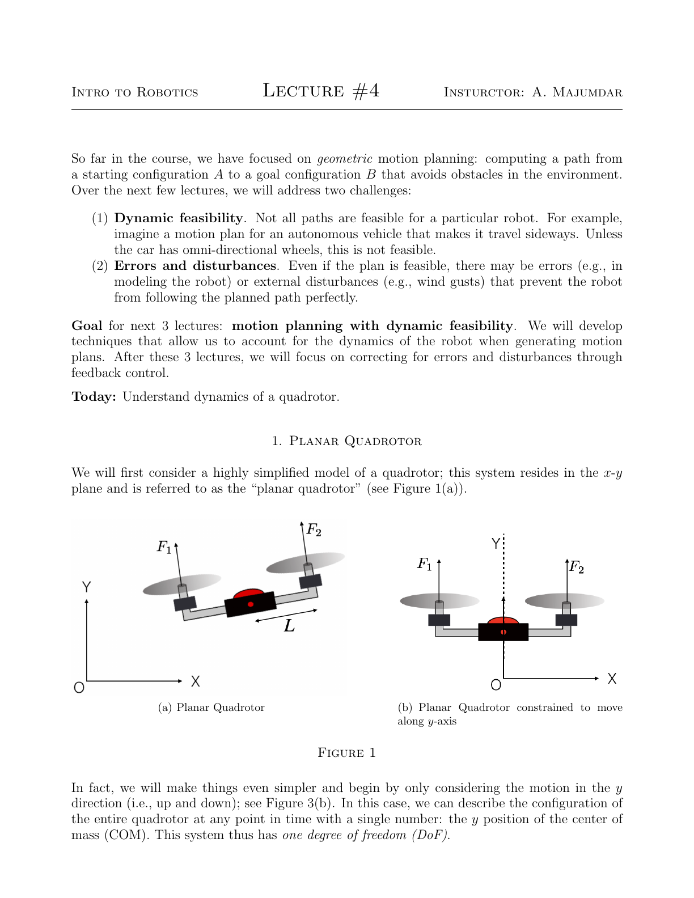
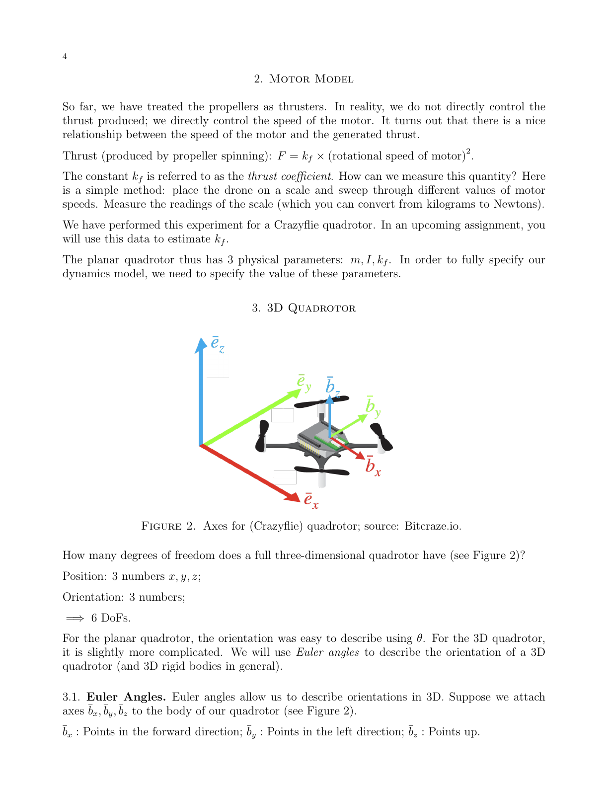
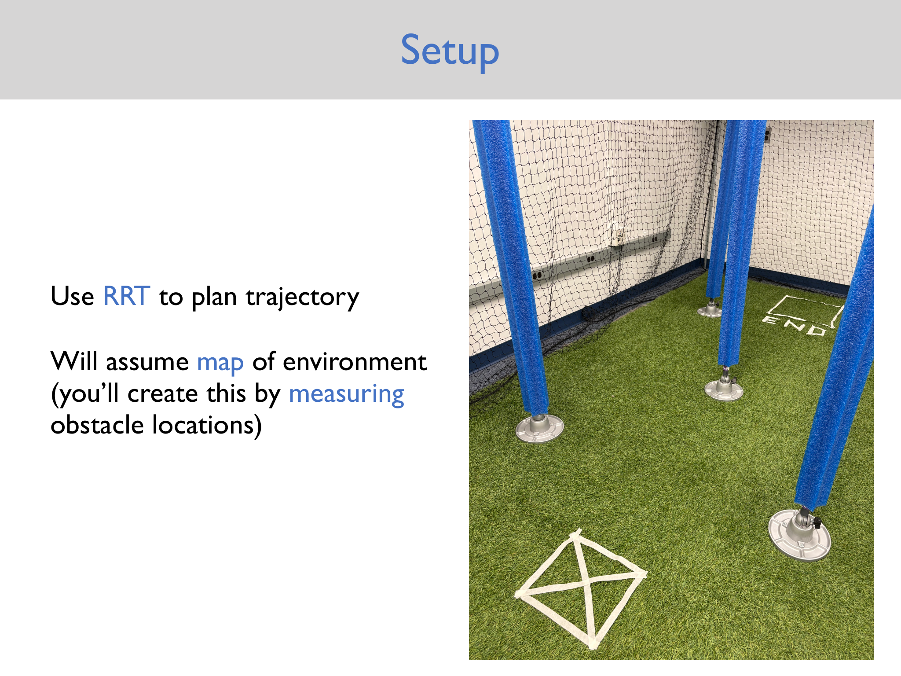
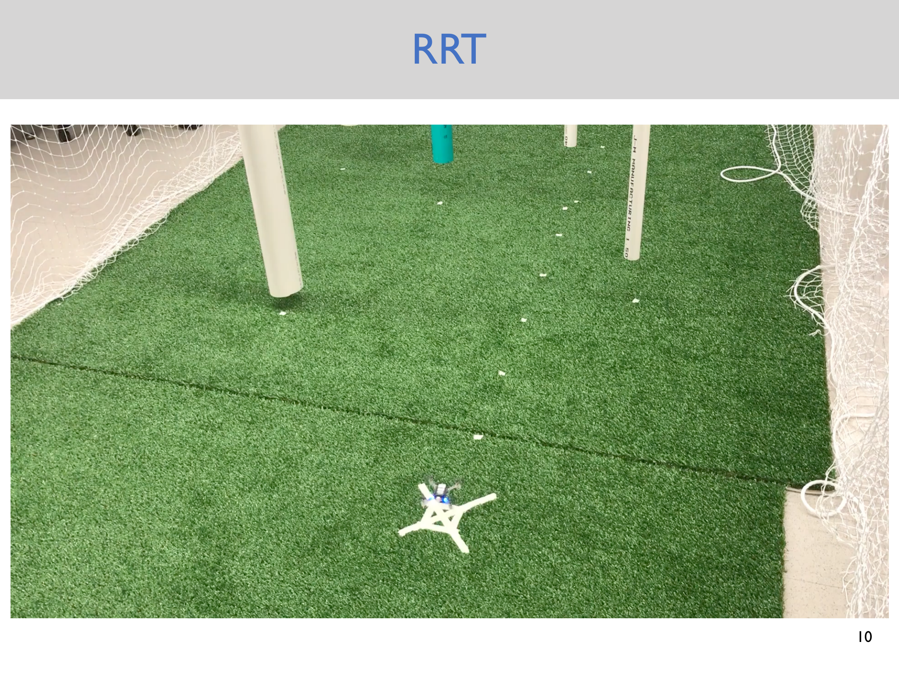
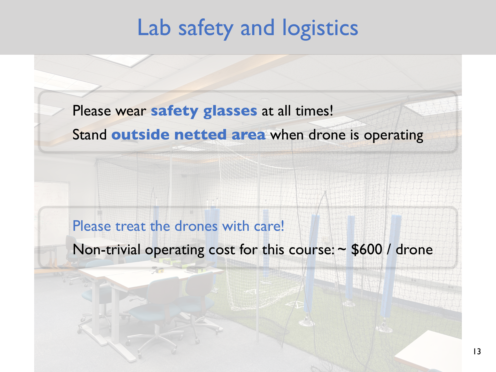

# Lecture 4 — Quadrotor Dynamics

> - **Topic:** Planar and three-dimensional quadrotor dynamics, state, inputs, and motor models
> - **Instructor:** Anirudha Majumdar
> - **Course:** Princeton ROB 345/549, Fall 2026
> - **Official course page:** <https://irom-lab.princeton.edu/intro-to-robotics/>
> - **Lecture video:** <https://www.youtube.com/watch?v=upI4KaGawyE>
> - **Lecture slides:** <https://www.dropbox.com/scl/fi/v8bp2gyhpixill7c70u7q/Lecture4_slides.pdf?dl=0&rlkey=h44i0kp1bpmxk3zdg65gvqu29>
> - **Lecture notes:** <https://www.dropbox.com/scl/fi/onuvrtpb64sytgp78towu/Lecture4_notes.pdf?dl=0&rlkey=yo9dpy9jxt7730f0ex3sjdcuw>
> - **Accessed:** 2026-09-26

## Lecture at a glance

The first lectures planned collision-free geometric paths. Lecture 4 introduces the second requirement: a path must also be dynamically feasible for the particular robot. A car cannot execute an arbitrary sideways path, and a quadrotor cannot instantaneously change position, orientation, or velocity. Even a dynamically feasible plan can be perturbed by modeling error, wind, sensing error, and actuator variation.

The lecture builds a hierarchy of models. It starts with a one-degree-of-freedom vertical model, expands to a planar quadrotor with position and attitude, then describes the state and inputs of a full 3D quadrotor. The common mathematical form is a first-order nonlinear system,

$$
\dot{\bar{x}} = f(\bar{x},\bar{u}),
$$

which will support later planning and control work.

## Learning objectives

After reviewing this lecture, you should be able to:

- distinguish geometric feasibility from dynamic feasibility;
- derive the one-dimensional vertical equation from Newton's second law;
- identify the planar quadrotor's configuration, state, and control inputs;
- explain how thrust and differential thrust produce translation and rotation;
- describe the thrust-to-motor-speed model;
- state the six degrees of freedom and twelve state variables of the 3D model;
- identify the space 1-2-3 Euler-angle convention used in the notes; and
- explain the structure of the full 3D equations without needing to derive every term.

## 1. Why geometry is not enough

The geometric planner from Lectures 2–3 treats a path as a sequence of collision-free configurations. That abstraction suppresses time, velocity, acceleration, forces, and actuator limits. The lecture highlights two problems:

1. **Dynamic feasibility:** some geometric paths cannot be produced by the robot's equations of motion or available actuators.
2. **Errors and disturbances:** a feasible plan may still be followed imperfectly because the model is approximate or the environment applies disturbances such as wind.

The goal of the next three lectures is motion planning with dynamic feasibility. After that block, the course turns to feedback control for correcting errors and disturbances.

## 2. One-dimensional vertical model

Begin with a highly simplified planar quadrotor constrained to move only along the vertical $y$ axis. The center-of-mass position $y$ is the only configuration variable, so the system has one degree of freedom.

Let $F_1$ and $F_2$ be the two upward rotor thrusts, $m$ the total mass, and $g$ gravitational acceleration. Newton's second law gives

$$
m\ddot{y} = F_1 + F_2 - mg.
$$

Define the total thrust input

$$
u_1 \triangleq F_1+F_2.
$$

Then the vertical acceleration is

$$
\ddot{y}=\frac{u_1}{m}-g.
$$

This model already shows the distinction between a physical input and a desired position: the input is thrust, while position changes only after integrating acceleration over time.

## 3. Planar quadrotor dynamics

Release the constraint on horizontal motion. The planar quadrotor has three configuration variables:

$$
q=(x,y,\theta),
$$

where $x$ and $y$ locate the center of mass and $\theta$ is the body orientation in the plane. The thrust direction rotates with $\theta$, so the same total thrust produces different horizontal and vertical accelerations.

The equations in the lecture are

$$
\ddot{x}=-\frac{u_1}{m}\sin\theta,
$$

$$
\ddot{y}=\frac{u_1}{m}\cos\theta-g,
$$

$$
\ddot{\theta}=\frac{(F_2-F_1)L}{I},
$$

where $I$ is the planar moment of inertia and $L$ is the rotor-arm length in the diagram. Define the total moment input

$$
u_2 \triangleq (F_2-F_1)L,
$$

so the rotational equation becomes $\ddot{\theta}=u_2/I$.

The sign convention in the equations depends on the axes and rotor labels in the lecture figure. The important structural facts are that total thrust controls force along the body thrust direction, while differential thrust creates a moment.

*Source: Figure 1 in the official Lecture 4 notes, [Lecture4_notes.pdf](https://www.dropbox.com/scl/fi/onuvrtpb64sytgp78towu/Lecture4_notes.pdf?dl=0&rlkey=yo9dpy9jxt7730f0ex3sjdcuw).*

### Sanity check at level attitude

When $\theta=0$, the planar equations reduce to

$$
\ddot{x}=0,\qquad \ddot{y}=\frac{u_1}{m}-g,
$$

so the vertical equation agrees with the one-dimensional model. Hovering in this idealized model requires $u_1=mg$ and $u_2=0$.

## 4. From second-order equations to a state-space model

Introduce velocity variables

$$
v_x\triangleq\dot{x},\qquad v_y\triangleq\dot{y},\qquad \omega\triangleq\dot{\theta}.
$$

The planar state is

$$
\bar{x}=[x,y,\theta,\dot{x},\dot{y},\dot{\theta}]^T
=[x,y,\theta,v_x,v_y,\omega]^T,
$$

so it has six components. The configuration is only the first three components, while the velocities are needed to predict future motion. The control input is

$$
\bar{u}=[u_1,u_2]^T.
$$

The six first-order equations can be written compactly as

$$
\dot{\bar{x}}=f(\bar{x},\bar{u}).
$$

Writing the model this way is useful because trajectory planning and feedback control can share the same state and dynamics interface.

## 5. Motor model

The controller does not directly command a thrust force. It commands motor speed, and the propeller produces thrust approximately according to

$$
F=k_f\omega_m^2,
$$

where $\omega_m$ is the motor's rotational speed and $k_f$ is the thrust coefficient. The lecture suggests estimating $k_f$ by placing the drone on a scale, sweeping motor speeds, and converting the scale readings to force.

For the planar model, the physical parameters needed to specify the simplified dynamics are $m$, $I$, and $k_f$. In a real system, this relation is an approximation; battery voltage, propeller condition, aerodynamic effects, and motor dynamics can all affect the mapping.

## 6. Full 3D quadrotor model

A rigid quadrotor has six configuration degrees of freedom:

| Component | Variables |
|---|---|
| Position | $x,y,z$ |
| Orientation | three angles, represented here by $\phi,\theta,\psi$ |

The lecture uses Euler angles and defines a body frame $B$ with axes $\bar b_x$ (forward), $\bar b_y$ (left), and $\bar b_z$ (up), plus an inertial frame $I$ with axes $\bar e_x,\bar e_y,\bar e_z$.

### Space 1-2-3 Euler angles

The convention used in the notes is:

1. rotate about the inertial $\bar e_x$ axis by $\phi$ (**roll**);
2. then rotate about the inertial $\bar e_y$ axis by $\theta$ (**pitch**); and
3. then rotate about the inertial $\bar e_z$ axis by $\psi$ (**yaw**).

This is the **space 1-2-3** convention. Other rotation orders and body-axis conventions are possible, so mixing conventions between a planner, estimator, and controller can change signs and produce serious errors.

*Source: Figure 2 in the official Lecture 4 notes, [Lecture4_notes.pdf](https://www.dropbox.com/scl/fi/onuvrtpb64sytgp78towu/Lecture4_notes.pdf?dl=0&rlkey=yo9dpy9jxt7730f0ex3sjdcuw).*

The 3D state used in the notes is

$$
\bar{x}=[x,y,z,\phi,\theta,\psi,\dot{x},\dot{y},\dot{z},p,q,r]^T.
$$

The angular velocities $p,q,r$ are convenient body angular-rate variables and are directly related to, but are not generally identical to, the Euler-angle derivatives $\dot{\phi},\dot{\theta},\dot{\psi}$.

The four-input representation is

$$
\bar{u}=[F_{\mathrm{tot}},M_1,M_2,M_3]^T,
$$

where $F_{\mathrm{tot}}$ is total thrust and $M_1,M_2,M_3$ are moments about the three axes. These inputs can be converted to and from the four individual rotor thrusts.

## 7. Rotor thrust and aerodynamic moments

For rotor $i$,

$$
F_i=k_f\omega_i^2,\qquad i=1,2,3,4.
$$

The spinning propeller also creates an aerodynamic drag moment about the body vertical axis:

$$
M_i^{\mathrm{aero}}=k_m\omega_i^2,
$$

where $k_m$ is a moment coefficient. Adjacent rotors spin in opposite directions, so their aerodynamic moments oppose one another. The imbalance of these moments is what permits yaw control.

## 8. Structure of the full dynamics

Let the inertial position and velocity be

$$
\bar r=[x,y,z]^T,\qquad \dot{\bar r}=[\dot{x},\dot{y},\dot{z}]^T.
$$

The translational acceleration has gravity plus the body thrust rotated into the inertial frame:

$$
\ddot{\bar r}
=
\begin{bmatrix}0\\0\\-g\end{bmatrix}
+R(\phi,\theta,\psi)
\begin{bmatrix}0\\0\\F_{\mathrm{tot}}/m\end{bmatrix}.
$$

Here $R$ maps a vector expressed in the body frame into the inertial frame. The lecture intentionally sketches rather than derives the complete rotation matrix and Euler-rate mapping.

For body angular velocity $\bar\omega_{BW}=[p,q,r]^T$, the angular dynamics are sketched as

$$
\dot{\bar\omega}_{BW}
=I^{-1}\left[-\bar\omega_{BW}\times(I\bar\omega_{BW})
+\begin{bmatrix}M_1\\M_2\\M_3\end{bmatrix}\right],
$$

with inertia matrix

$$
I=\begin{bmatrix}
I_{xx}&0&0\\
0&I_{yy}&0\\
0&0&I_{zz}
\end{bmatrix}
$$

in the simplified diagonal form shown in the notes. Together with the Euler-angle kinematics, these equations have the same general form $\dot{\bar{x}}=f(\bar{x},\bar{u})$ as the planar model.

## 9. Lab logistics and safety

The Lecture 4 slides connect the model to the upcoming RRT hardware lab. Students use the measured obstacle layout of a netted drone space to plan a trajectory. The slides list four drones in G109, three in the SEAS Robotics Lab, spare parts, measuring tape, and safety glasses. They also emphasize wearing safety glasses, staying outside the netted area while a drone operates, taking turns in the space, and treating the hardware carefully. These are course logistics and may change; follow the current lab instructions and staff guidance.

*Source: official Lecture 4 slides, PDF page 9, [Lecture4_slides.pdf](https://www.dropbox.com/scl/fi/v8bp2gyhpixill7c70u7q/Lecture4_slides.pdf?dl=0&rlkey=h44i0kp1bpmxk3zdg65gvqu29).*

*Source: official Lecture 4 slides, PDF page 10, [Lecture4_slides.pdf](https://www.dropbox.com/scl/fi/v8bp2gyhpixill7c70u7q/Lecture4_slides.pdf?dl=0&rlkey=h44i0kp1bpmxk3zdg65gvqu29).*

*Source: official Lecture 4 slides, PDF page 13, [Lecture4_slides.pdf](https://www.dropbox.com/scl/fi/v8bp2gyhpixill7c70u7q/Lecture4_slides.pdf?dl=0&rlkey=h44i0kp1bpmxk3zdg65gvqu29).*

## 10. Assumptions, limitations, and common pitfalls

- **Planar versus 3D:** The planar equations are a teaching model, not a complete Crazyflie model.
- **Thrust alignment:** The force decomposition assumes a particular body-axis and sign convention; verify it before implementing a controller.
- **Rigid-body idealization:** The equations omit aerodynamic drag, ground effect, flexible components, motor lag, battery variation, and disturbances.
- **Euler-angle convention:** Rotation order matters. The notes use space 1-2-3; do not silently substitute another convention.
- **Euler singularities:** Euler angles can become ill-conditioned at singular orientations. This is a supplemental mathematical limitation of the representation, not a claim made in the lecture's derivation.
- **State is more than pose:** Position and attitude alone do not determine future motion; velocities and angular rates are part of the state.
- **Model input versus actuator command:** $F_{\mathrm{tot}}$ and $M_i$ are convenient dynamics inputs, while hardware commands are individual motor speeds or lower-level setpoints.
- **Geometric path versus trajectory:** A path has no timing; a trajectory assigns time and therefore velocities, accelerations, and actuator demands.

## 11. Connections to the rest of the course

Lecture 3's RRT can produce a collision-free geometric path, but Lecture 4 explains why that path needs a dynamics model before it can be executed. Assignment 2 makes this connection concrete: its RRT plans through measured obstacles and then sends a sequence of Crazyflie position setpoints. Later planning-with-dynamics lectures will address how to generate motions that respect the system model, while feedback-control lectures will address tracking errors and disturbances.

## Review questions

1. Give an example of a geometrically feasible but dynamically infeasible path.
2. Why does differential thrust create a planar rotation moment?
3. What do $u_1$ and $u_2$ represent in the planar model?
4. Why is the planar state six-dimensional even though the configuration has three variables?
5. How could you estimate $k_f$ experimentally?
6. What are the six configuration degrees of freedom of a 3D quadrotor?
7. Distinguish Euler angles from body angular velocities $p,q,r$.
8. Why must a planner and controller agree on the body and inertial frame conventions?
9. Which terms in the full 3D model represent gravity, rotated thrust, and rotational coupling?
10. Why is an RRT path not yet a flight trajectory?

## Compact takeaway

Quadrotor planning must connect geometry to physics:

$$
\text{path in configuration space}
\longrightarrow
\text{time-parameterized trajectory}
\longrightarrow
\text{thrust and moment commands}.
$$

The lecture's hierarchy—from vertical motion to planar dynamics to the full 3D state-space form—builds the vocabulary needed to reason about that connection without hiding the assumptions inside a black-box controller.
